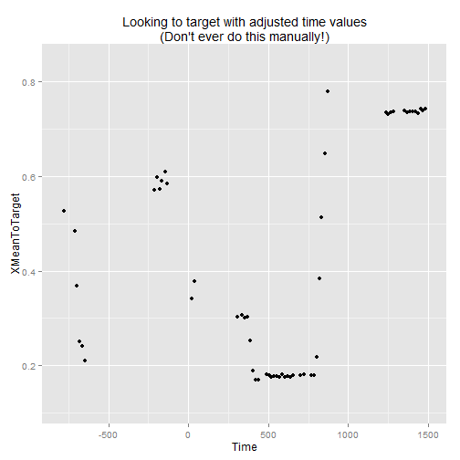

Data Structures and Abstractions
===============================================================================

In this doc, I discuss what makes up our eye-tracking data and the main levels of abstraction that we use to contain the data.


Eye-tracking data
-------------------------------------------------------------------------------

Here are the files that make up a single subject's eye-tracking data. This participant received two blocks of the coarticulation experiment.


```r
data_files <- list.files("data/Coartic_WFFArea_2a/001P00XS1/")
data_files
```

```
## [1] "Coartic_Block1_001P00XS1.gazedata" "Coartic_Block1_001P00XS1.txt"     
## [3] "Coartic_Block2_001P00XS1.gazedata" "Coartic_Block2_001P00XS1.txt"
```


Each experimental block produces a `.txt` file and a `.gazedata` file. These two files contain all the pertinent experimental data for an eye-tracking block. During an experiment, Eprime also produces an `.edat` file, but that file is unusable outside of Eprime so we ignore it.

The `.txt` and `.gazedata` files for a block should have the same basename (i.e., the same filename, except for the file extension). When we truncate the file extensions, we see that we only have two unique filenames, one for each block of data.


```r
unique(tools::file_path_sans_ext(data_files))
```

```
## [1] "Coartic_Block1_001P00XS1" "Coartic_Block2_001P00XS1"
```


### Stimdata

The `.txt` file for a block is the _Stimdata_ file. It contains information about each experimental trial (like stimulus presentation or event timing). Eprime generates this file, and it's not pretty. Here is a single trial, as recorded in the file.

```
		*** LogFrame Start ***
		TrialList: 1
		Procedure: TrialProcedure
		ImageL: BoardBook1
		ImageR: StuffedDog1
		Carrier: Where
		Target: ImageL
		Pitch: hi
		AudioStim: Whe_hi_the_V_Book_neut
		Attention: AN_LookAtThat
		AudioDur: 2190
		AttentionDur: 1500
		WordGroup: dog-book
		StimType: neutral
		TargetWord: book
		Running: TrialList
		TrialList.Cycle: 1
		TrialList.Sample: 1
		Image2sec.OnsetTime: 37347
		Image2sec.StartTime: 37324
		Fixation.OnsetDelay: 39
		Fixation.OnsetTime: 38902
		Fixation.StartTime: 38893
		Target.OnsetDelay: 0
		Target.OnsetTime: 39353
		Target.StartTime: 39289
		Wait1SecFirst.OnsetDelay: 0
		Wait1SecFirst.OnsetTime: 41543
		Wait1SecFirst.StartTime: 41543
		Attention.OnsetDelay: 3
		Attention.OnsetTime: 42546
		Attention.StartTime: 42343
		*** LogFrame End ***
```

The `Stimdata()` function extracts and massages the pertinent experimental information from the stimdata file into a dataframe. The massaging process is complex and kind of a pain, but it handles the many iterations of our eye-tracking experiments: It determines which task is being performed and with which stimulus presentation protocol, and it adjusts the timing attributes accordingly. If we design and implement a new experiment or a new version of an existing experiment, I usually edit the backend of `Stimdata()` function to account for the new experiment.

Anyway, in the output of `Stimdata()`, each row of the dataframe represents the attributes of an experimental trial. 


```r
stim_path <- "data/Coartic_WFFArea_2a/001P00XS1/Coartic_Block1_001P00XS1.txt"
stimdata <- Stimdata(stim_path)
```

```
## Reading stimdata in data/Coartic_WFFArea_2a/001P00XS1/Coartic_Block1_001P00XS1.txt
```

```r
str(stimdata)
```

```
## Classes 'Coartic', 'Stimdata' and 'data.frame':	24 obs. of  33 variables:
##  $ Task             : chr  "Coartic" "Coartic" "Coartic" "Coartic" ...
##  $ DateTime         : POSIXct, format: "2013-02-12 10:54:38" "2013-02-12 10:54:38" ...
##  $ Subject          : chr  "001P00XS1" "001P00XS1" "001P00XS1" "001P00XS1" ...
##  $ Block            : num  1 1 1 1 1 1 1 1 1 1 ...
##  $ TrialNo          : int  1 2 3 4 5 6 7 8 9 10 ...
##  $ TargetWord       : chr  "book" "ball" "sock" "duck" ...
##  $ ImageL           : chr  "BoardBook1" "Duck1" "Cup1" "Duck2" ...
##  $ ImageR           : chr  "StuffedDog1" "Ball1" "Sock1" "Ball2" ...
##  $ TargetImage      : chr  "ImageL" "ImageR" "ImageR" "ImageL" ...
##  $ DistractorImage  : chr  "ImageR" "ImageL" "ImageL" "ImageR" ...
##  $ Carrier          : chr  "Where" "Where" "See" "Find" ...
##  $ Target           : chr  "book" "ball" "sock" "duck" ...
##  $ Audio            : chr  "Whe_hi_the_V_Book_neut" "Whe_lo_the_B_Ball_faci" "See_hi_the_V_Sock_neut" "Fin_lo_the_V_Duck_neut" ...
##  $ Attention        : chr  "AN_LookAtThat" "AN_CheckitOut" "AN_ThisIsFun" "AN_CheckitOut" ...
##  $ WordGroup        : chr  "dog-book" "duck-ball" "sock-cup" "duck-ball" ...
##  $ StimType         : chr  "neutral" "facilitating" "filler" "neutral" ...
##  $ AttentionDur     : num  1500 1500 1500 1500 1500 1500 1500 1500 1500 1500 ...
##  $ ImageOnset       : num  37347 45940 54517 63195 71822 ...
##  $ FixationOnset    : num  38902 47495 56089 64750 73377 ...
##  $ DelayCarrierOnset: num  0 1 0 0 1 0 1 1 1 1 ...
##  $ CarrierOnset     : num  39353 47947 56624 65251 74564 ...
##  $ AttentionOnset   : num  42546 51140 59817 68445 77757 ...
##  $ Pitch            : chr  "hi" "lo" "hi" "lo" ...
##  $ CarrierDur       : num  1340 1340 1340 1340 1340 1340 1340 1340 1340 1340 ...
##  $ TargetDur        : num  850 850 850 850 850 850 850 850 850 850 ...
##  $ DelayTargetOnset : num  0 0 0 0 0 0 0 0 0 0 ...
##  $ Protocol         : chr  "WFF_Area" "WFF_Area" "WFF_Area" "WFF_Area" ...
##  $ AttentionEnd     : num  44046 52640 61317 69945 79257 ...
##  $ TargetEnd        : num  41543 50137 58814 67441 76754 ...
##  $ CarrierEnd       : num  40693 49287 57964 66591 75904 ...
##  $ TargetOnset      : num  40693 49287 57964 66591 75904 ...
##  $ FixationDur      : num  451 452 535 501 1187 ...
##  $ Basename         : chr  "Coartic_Block1_001P00XS1" "Coartic_Block1_001P00XS1" "Coartic_Block1_001P00XS1" "Coartic_Block1_001P00XS1" ...
```


### Gazedata

The `.gazedata` file contains tab-delimited _Gazedata_ from the eye-tracker for the entire block. 


```r
gaze_path <- "data/Coartic_WFFArea_2a/001P00XS1/Coartic_Block1_001P00XS1.gazedata"
raw_gaze <- read.delim(gaze_path, na.strings = c("-1.#INF", "1.#INF"), stringsAsFactors = FALSE)
str(raw_gaze)
```

```
## 'data.frame':	12573 obs. of  26 variables:
##  $ Subject              : int  1 1 1 1 1 1 1 1 1 1 ...
##  $ Session              : int  1 1 1 1 1 1 1 1 1 1 ...
##  $ ID                   : int  1 2 3 4 5 6 7 8 9 10 ...
##  $ TETTime              : num  1.36e+12 1.36e+12 1.36e+12 1.36e+12 1.36e+12 ...
##  $ RTTime               : int  37312 37329 37345 37362 37378 37395 37412 37428 37445 37461 ...
##  $ CursorX              : int  692 695 695 690 688 686 687 690 692 685 ...
##  $ CursorY              : int  532 527 522 517 518 519 521 526 532 519 ...
##  $ TimestampSec         : int  1360680900 1360680900 1360680900 1360680900 1360680900 1360680900 1360680900 1360680900 1360680900 1360680900 ...
##  $ TimestampMicrosec    : int  777681 794301 811051 827673 844297 860924 877667 894289 910915 927535 ...
##  $ XGazePosLeftEye      : num  0.355 0.352 0.359 0.353 0.35 ...
##  $ YGazePosLeftEye      : num  0.439 0.441 0.436 0.435 0.442 ...
##  $ XCameraPosLeftEye    : num  0.613 0.613 0.614 0.614 0.614 ...
##  $ YCameraPosLeftEye    : num  0.837 0.838 0.838 0.838 0.838 ...
##  $ DiameterPupilLeftEye : num  3.59 3.53 3.58 3.51 3.49 ...
##  $ DistanceLeftEye      : num  547 547 547 547 547 ...
##  $ ValidityLeftEye      : int  0 0 0 0 0 0 0 0 0 0 ...
##  $ XGazePosRightEye     : num  0.367 0.372 0.366 0.366 0.367 ...
##  $ YGazePosRightEye     : num  0.449 0.438 0.434 0.427 0.421 ...
##  $ XCameraPosRightEye   : num  0.468 0.468 0.468 0.468 0.469 ...
##  $ YCameraPosRightEye   : num  0.807 0.807 0.808 0.808 0.808 ...
##  $ DiameterPupilRightEye: num  3.46 3.38 3.36 3.39 3.33 ...
##  $ DistanceRightEye     : num  545 545 545 545 545 ...
##  $ ValidityRightEye     : int  0 0 0 0 0 0 0 0 0 0 ...
##  $ TrialId              : int  1 1 1 1 1 1 1 1 1 1 ...
##  $ Target               : chr  "ImageL" "ImageL" "ImageL" "ImageL" ...
##  $ Stimulus             : chr  "CarrierStim" "CarrierStim" "CarrierStim" "CarrierStim" ...
```


We don't need all these columns [TODO document these variables], so `Gazedata()` keeps just the ones we care about. The function also computes the monocular averages for each gaze-data variable, combining avaialble data from the left and right eyes. 


```r
gazedata <- Gazedata(gaze_path)
str(gazedata)
```

```
## Classes 'Gazedata' and 'data.frame':	12573 obs. of  18 variables:
##  $ Task         : chr  "Coartic" "Coartic" "Coartic" "Coartic" ...
##  $ Subject      : chr  "001P00XS1" "001P00XS1" "001P00XS1" "001P00XS1" ...
##  $ BlockNo      : int  1 1 1 1 1 1 1 1 1 1 ...
##  $ Basename     : chr  "Coartic_Block1_001P00XS1" "Coartic_Block1_001P00XS1" "Coartic_Block1_001P00XS1" "Coartic_Block1_001P00XS1" ...
##  $ TrialNo      : int  1 1 1 1 1 1 1 1 1 1 ...
##  $ Time         : int  37312 37329 37345 37362 37378 37395 37412 37428 37445 37461 ...
##  $ XLeft        : num  0.355 0.352 0.359 0.353 0.35 ...
##  $ XRight       : num  0.367 0.372 0.366 0.366 0.367 ...
##  $ XMean        : num  0.361 0.362 0.362 0.36 0.359 ...
##  $ YLeft        : num  0.561 0.559 0.564 0.565 0.558 ...
##  $ YRight       : num  0.551 0.562 0.566 0.573 0.579 ...
##  $ YMean        : num  0.556 0.561 0.565 0.569 0.568 ...
##  $ ZLeft        : num  547 547 547 547 547 ...
##  $ ZRight       : num  545 545 545 545 545 ...
##  $ ZMean        : num  546 546 546 546 546 ...
##  $ DiameterLeft : num  3.59 3.53 3.58 3.51 3.49 ...
##  $ DiameterRight: num  3.46 3.38 3.36 3.39 3.33 ...
##  $ DiameterMean : num  3.53 3.46 3.47 3.45 3.41 ...
```


Sometimes only one of the eyes is tracked, so we use data from the available eye to compute the monocular average, as shown in the example below. Some researchers advise against this kind of interpolation [citation TODO]. 


```r
xmean_from_right <- subset(gazedata[c("XLeft", "XRight", "XMean")], is.na(XLeft) & 
    !is.na(XRight))
head(xmean_from_right)
```

```
##     XLeft XRight  XMean
## 26     NA 0.3737 0.3737
## 51     NA 0.8178 0.8178
## 75     NA 0.2354 0.2354
## 77     NA 0.2078 0.2078
## 229    NA 0.8307 0.8307
## 322    NA 0.2721 0.2721
```


Trials, Blocks and Sessions
-------------------------------------------------------------------------------

### Block

Now that we have the stimdata for each trial and the gazedata from the whole block, we can combine these two together using `Block()`. This function slices up the gazedata, creating a dataframe for each trial. The stimulus properties for each trial are attached to the trial as attributes. The gazedata dataframe and attached stimdata make up a `Trial` object. The code below shows the structure of a single trial.


```r
block <- Block(gazedata, stimdata)
trial <- block[[1]]
str(trial)
```

```
## Classes 'Trial' and 'data.frame':	465 obs. of  24 variables:
##  $ Task          : chr  "Coartic" "Coartic" "Coartic" "Coartic" ...
##  $ Subject       : chr  "001P00XS1" "001P00XS1" "001P00XS1" "001P00XS1" ...
##  $ BlockNo       : int  1 1 1 1 1 1 1 1 1 1 ...
##  $ Basename      : chr  "Coartic_Block1_001P00XS1" "Coartic_Block1_001P00XS1" "Coartic_Block1_001P00XS1" "Coartic_Block1_001P00XS1" ...
##  $ TrialNo       : int  1 1 1 1 1 1 1 1 1 1 ...
##  $ Time          : int  37312 37329 37345 37362 37378 37395 37412 37428 37445 37461 ...
##  $ XLeft         : num  0.355 0.352 0.359 0.353 0.35 ...
##  $ XRight        : num  0.367 0.372 0.366 0.366 0.367 ...
##  $ XMean         : num  0.361 0.362 0.362 0.36 0.359 ...
##  $ YLeft         : num  0.561 0.559 0.564 0.565 0.558 ...
##  $ YRight        : num  0.551 0.562 0.566 0.573 0.579 ...
##  $ YMean         : num  0.556 0.561 0.565 0.569 0.568 ...
##  $ ZLeft         : num  547 547 547 547 547 ...
##  $ ZRight        : num  545 545 545 545 545 ...
##  $ ZMean         : num  546 546 546 546 546 ...
##  $ DiameterLeft  : num  3.59 3.53 3.58 3.51 3.49 ...
##  $ DiameterRight : num  3.46 3.38 3.36 3.39 3.33 ...
##  $ DiameterMean  : num  3.53 3.46 3.47 3.45 3.41 ...
##  $ YMeanToTarget : num  0.556 0.561 0.565 0.569 0.568 ...
##  $ YRightToTarget: num  0.551 0.562 0.566 0.573 0.579 ...
##  $ YLeftToTarget : num  0.561 0.559 0.564 0.565 0.558 ...
##  $ XMeanToTarget : num  0.639 0.638 0.638 0.64 0.641 ...
##  $ XRightToTarget: num  0.633 0.628 0.634 0.634 0.633 ...
##  $ XLeftToTarget : num  0.645 0.648 0.641 0.647 0.65 ...
##  - attr(*, "Task")= chr "Coartic"
##  - attr(*, "DateTime")= POSIXct, format: "2013-02-12 10:54:38"
##  - attr(*, "Subject")= chr "001P00XS1"
##  - attr(*, "Block")= num 1
##  - attr(*, "TrialNo")= int 1
##  - attr(*, "TargetWord")= chr "book"
##  - attr(*, "ImageL")= chr "BoardBook1"
##  - attr(*, "ImageR")= chr "StuffedDog1"
##  - attr(*, "TargetImage")= chr "ImageL"
##  - attr(*, "DistractorImage")= chr "ImageR"
##  - attr(*, "Carrier")= chr "Where"
##  - attr(*, "Target")= chr "book"
##  - attr(*, "Audio")= chr "Whe_hi_the_V_Book_neut"
##  - attr(*, "Attention")= chr "AN_LookAtThat"
##  - attr(*, "WordGroup")= chr "dog-book"
##  - attr(*, "StimType")= chr "neutral"
##  - attr(*, "AttentionDur")= num 1500
##  - attr(*, "ImageOnset")= num 37347
##  - attr(*, "FixationOnset")= num 38902
##  - attr(*, "DelayCarrierOnset")= num 0
##  - attr(*, "CarrierOnset")= num 39353
##  - attr(*, "AttentionOnset")= num 42546
##  - attr(*, "Pitch")= chr "hi"
##  - attr(*, "CarrierDur")= num 1340
##  - attr(*, "TargetDur")= num 850
##  - attr(*, "DelayTargetOnset")= num 0
##  - attr(*, "Protocol")= chr "WFF_Area"
##  - attr(*, "AttentionEnd")= num 44046
##  - attr(*, "TargetEnd")= num 41543
##  - attr(*, "CarrierEnd")= num 40693
##  - attr(*, "TargetOnset")= num 40693
##  - attr(*, "FixationDur")= num 451
##  - attr(*, "Basename")= chr "Coartic_Block1_001P00XS1"
```


### ToTarget

When the stimdata and gazedata are combined, six new columns are also produced. The columns all end in `ToTarget` and they describe the screen location of the gaze in terms of proximity to the target image. That is, plain-old `XMean` describes the location of the gaze such that 0 is the left side of the screen and 1 is the right side. In the `trial` above, the target word is on the left side of the screen, so small `XMean` values are closer to the left side of the screen and hence closer to the target. In `XMeanToTarget`, the `XMean` values are flipped so that greater values are closer to the target image. Essentially, the target image becomes the right image for all trials. This kind of normalization is useful if we want to look at the gaze-location with respect to the target image over several trials.


```r
# the added columns
grep("ToTarget", names(trial), value = TRUE)
```

```
## [1] "YMeanToTarget"  "YRightToTarget" "YLeftToTarget"  "XMeanToTarget" 
## [5] "XRightToTarget" "XLeftToTarget"
```

```r
library(ggplot2)
# default plot
qplot(data = trial, x = Time, y = XMean) + labs(title = "Raw XMean value")
```

 

```r
qplot(data = trial, x = Time, y = XMeanToTarget) + labs(title = "XMean flipped towards target")
```

 


### Working with attributes with `%@%` 

A `Block` is a list of `Trial` objects. We can access the attributes of multiple trials using the `%@%` function.


```r
block %@% "TargetWord"
```

```
##  [1] "book"   "ball"   "sock"   "duck"   "book"   "ball"   "cat"   
##  [8] "book"   "ball"   "cookie" "dog"    "duck"   "car"    "book"  
## [15] "duck"   "dog"    "shoe"   "dog"    "ball"   "cup"    "ball"  
## [22] "dog"    "duck"   "dog"
```

```r
block %@% "TargetImage"
```

```
##  [1] "ImageL" "ImageR" "ImageR" "ImageL" "ImageL" "ImageR" "ImageL"
##  [8] "ImageR" "ImageL" "ImageL" "ImageL" "ImageR" "ImageL" "ImageR"
## [15] "ImageL" "ImageR" "ImageR" "ImageL" "ImageR" "ImageR" "ImageL"
## [22] "ImageR" "ImageR" "ImageL"
```

```r
block %@% "TargetOnset"
```

```
##  [1]  40693  49287  57964  66591  75904  84514  96870 106233 119809 129707
## [11] 140290 149736 163546 172658 181737 190816 201967 216480 230925 240254
## [21] 248965 258111 274763 284059
```


The attribute-infix function `%@%` can also be used on single trials to get _and set_ their attribute values.


```r
trial %@% "TargetWord"
```

```
## [1] "book"
```

```r
trial %@% "TargetImage"
```

```
## [1] "ImageL"
```


Here's how one can use `%@%` to manually adjust the timing of trials so that the TargetOnset occurs at 0ms. You should never have to manually do this, because the `AlignTrials` functions does this for you.


```r
trial$Time <- trial$Time - (trial %@% "TargetOnset")
trial %@% "TargetOnset" <- 0
qplot(data = trial, x = Time, y = XMeanToTarget, xlim = c(-800, 1500)) + labs(title = "Looking to target with adjusted time values\n(Don't ever do this manually!)")
```

 


### Session


### Task

***


```r
Sys.time()
```

```
## [1] "2014-02-10 13:37:35 CST"
```

```r
sessionInfo()
```

```
## R version 3.0.2 (2013-09-25)
## Platform: x86_64-w64-mingw32/x64 (64-bit)
## 
## locale:
## [1] LC_COLLATE=English_United States.1252 
## [2] LC_CTYPE=English_United States.1252   
## [3] LC_MONETARY=English_United States.1252
## [4] LC_NUMERIC=C                          
## [5] LC_TIME=English_United States.1252    
## 
## attached base packages:
## [1] stats     graphics  grDevices utils     datasets  methods   base     
## 
## other attached packages:
## [1] ggplot2_0.9.3.1 lookr_0.1       knitr_1.5      
## 
## loaded via a namespace (and not attached):
##  [1] colorspace_1.2-4   dichromat_2.0-0    digest_0.6.4      
##  [4] evaluate_0.5.1     formatR_0.10       grid_3.0.2        
##  [7] gtable_0.1.2       labeling_0.2       lubridate_1.3.3   
## [10] MASS_7.3-29        memoise_0.1        munsell_0.4.2     
## [13] plyr_1.8           proto_0.3-10       RColorBrewer_1.0-5
## [16] reshape2_1.2.2     scales_0.2.3       stringr_0.6.2     
## [19] tools_3.0.2
```

